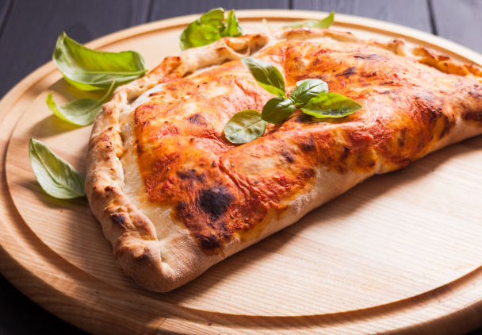
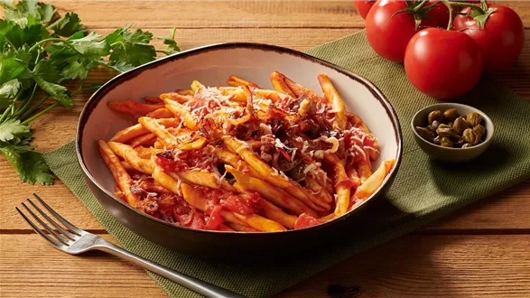
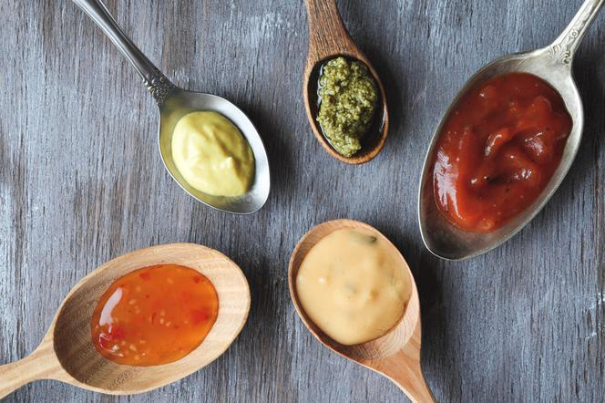
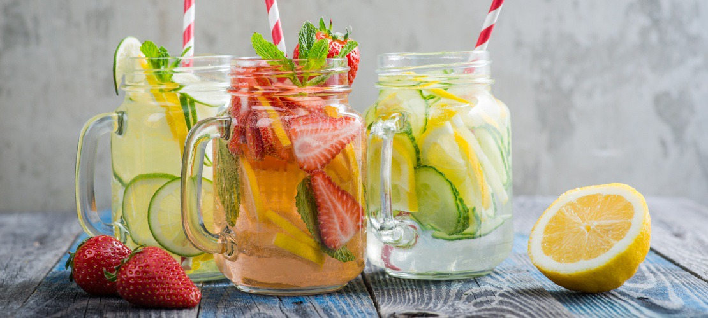

# Menu

## Pizze klasyczne

|NR.|Nazwa:|                                                                                 rozmiar:|             30cm|   50cm|  60cm |
|---|---------------------------------------------------------------------------------------|---------------------|------|------|------|
|1. | MARGHERITA (sos pomidorowy,ser,oregano)                                               |                     |20zł  |25zł  |32zł  |
|2. | VESUVIO (sos pomidorowy, szynka, ser, oregano)                                        |                     |25zł  |32zł  |40zł  |
|3. | SALAMI (sos pomidorowy, salami, ser, oregano)                                         |                     |27zł  |35zł  |42zł  |
|4. | POMODORE (sos pomidorowy, szynka, ser, pomidory, pieczarki, oregano)                  |                     |30zł  |35zł  |45zł  |
|5. |HAWAJSKA (sos pomidorowy, ananas, szynka, ser, oregano)                                |                     |27zł  |35zł  |42zł  |
|6. | KEBAB (sos pomidorowy, kebab, ogórek, pomidor, sałata lodowa, oregano, sos czosnkowy) |                     |35zł  |45zł  |55zł  |

## Pizza Calzone

|NR.|Nazwa:|                                                                                 rozmiar:|             30cm|   50cm|  60cm |
|---|---------------------------------------------------------------------------------------|---------------------|------|------|------|
|1. | Bolognese (sos bolognese,ser,oregano)                                                 |                     |35zł  |45zł  |55zł  |
|2. | Grecka (sos pomidorowy,ser,oliwki,feta,)                                              |                     |35zł  |45zł  |55zł  |
|3. | Barbeque (sos pomidorowy, kurczak, ser, boczek,cebula)                                |                     |27zł  |35zł  |42zł  |

## Makarony

|NR.|Nazwa:|                                                                                 porcja:|             500g|   800g| 
|---|---------------------------------------------------------------------------------------|---------------------|------|------|
|1. | Spaghetti Bolognese (makaron z sosem bolońskim)                                       |                     |30zł  |38zł  |
|2. | Spaghetti Bolonia (makaron z sosem bolońskim)                                         |                     |35zł  |40zł  |
|3. | Spaghetti Carbonara (makaron z sosem carbonara)                                       |                     |35zł  |40zł  |

## SOSY

|NR.|Nazwa:|                                                                                 porcja:|               mały|   duzy| 
|---|---------------------------------------------------------------------------------------|---------------------|------|------|
|1. | Sos Czosnkowy                                                                         |                     |5zł   |8zł   |
|2. | Sos Pomidorowy                                                                        |                     |5zł   |8zł   |
|3. | Sos Barbeque                                                                          |                     |5zł   |8zł   |
|4. | Sos Koperkowo-Jogurtowy                                                               |                     |5zł   |8zł   |
|5. | Sos Sambal                                                                            |                     |5zł   |8zł   |

## NAPOJE

|NR.|Nazwa:|                                                                                 porcja:|               330ml|   500ml| 
|---|---------------------------------------------------------------------------------------|---------------------|------|------|
|1. | Woda                                                                                  |                     |4zł   |6zł   |
|2. | Coca Cola                                                                             |                     |5zł   |9zł   |
|3. | Sprite                                                                                |                     |5zł   |9zł   |
|4. | Sok Jabłkowy                                                                          |                     |4zł   |7zł   |
